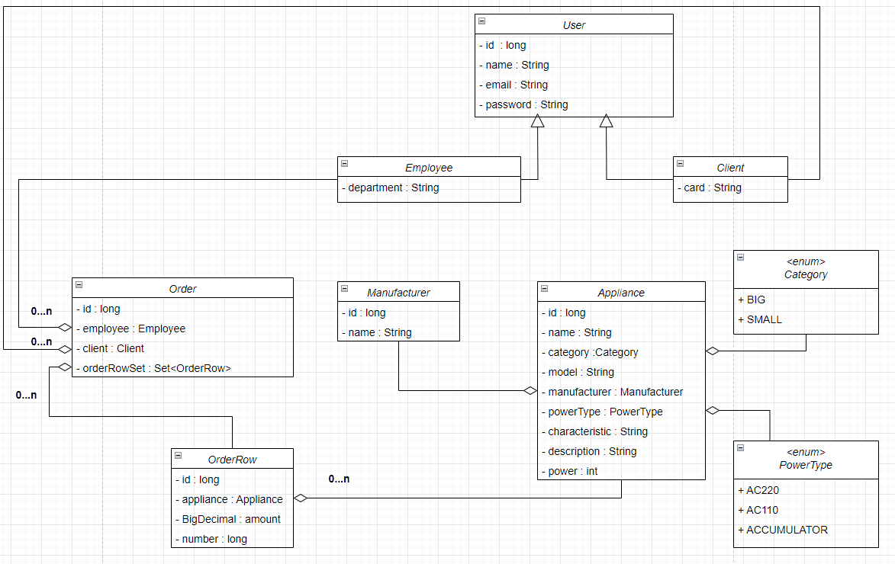

# Appliance store(spring boot solution)

The purpose of this exercise check your knowledge and understanding technology Spring boot.

Duration: **15** hour

## Description

In this exercise, you will implement "Appliances shop" using Spring boot.
Your application has to imitate work online shop.

Employees should be able to do the following:
1. `add`, `correct`, `delete` Employees, Client, Appliances, Manufacturers;
2. approve Orders.

Clients and employees should be able to do the following:
1. `add`, `correct`, `delete` Orders.

Users must be available work in two languages. For example English, Spanish, French ...

The class diagram of the Domain model is shown in the figure below:

Your application must implement next layers:
* `Repository` - work with necessary entities (JPA);
* `Service` - business logic your application;
* `Controller` - front end your application. 

You have files with initial data, but you can use other data. 
For loading initial data use
`spring.sql.init.data-locations=classpath:manufacturer.sql, classpath:client.sql, classpath:employee.sql, classpath:appliance.sql`
in `application.properties`.
Files with initial data located `resources`. Files list: `manufacturer.sql`, `client.sql`, `employee.sql`, `appliance.sql`.

Also, you may to using files to frond-end from `resources\templates\**` or use yourself frontend.  
### Requirements:
* Use skeleton application;
* Use H2 db to realisation storage;
* Use annotations to describe entities DB. List of entities:
  * `User`;
  * `Client`;
  * `Employee`;
  * `Manufacturer`;
  * `Appliance`;
  * `Order`;
  * `OrderRow`.
* Use Spring jpa technology;
* Use Spring security;
* Use Internationalization and Localization in controllers;
* Use validation for Domain model and controllers.

### Would be nice
* Using logging
* Using pagination and sorting in controllers
* Using other Spring technologies

### Recommendation
* Use `lombok`
* Use security in memory(Spring Security)
* If during work you do not have time to implement all the requirements, you can implement only part of the functionality. For example do `create` , `delete`, `correct` for Employee don`t do for Client.

Good luck. You have only 15 hours